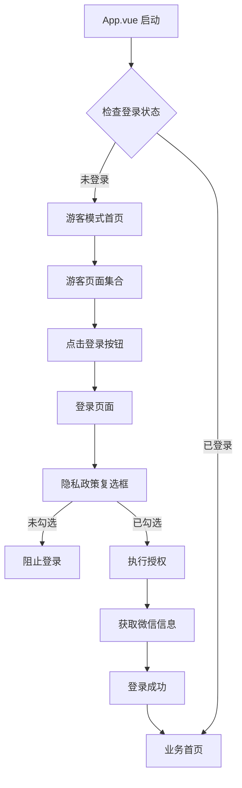

# Design Document

## Overview

本设计文档描述了微信小程序审核合规整改的技术实现方案。

**整改核心目标：**
1. 登录页面添加隐私政策复选框（替换"登录即表示同意"）
2. 创建独立的游客模式页面集合（使用示例数据）
3. 应用启动时直接进入游客模式（而非登录页）
4. 提供协议详情弹窗和完整的协议内容

**技术栈：**
- 框架：uni-app (Vue 3 + TypeScript)
- UI组件库：wot-design-uni  
- 状态管理：Pinia
- 构建目标：微信小程序

## Architecture

### 整体架构



### 目录结构设计

```
core-ledger-ui/
├── pages/
│   ├── guest/                    # 游客模式页面（新增）
│   │   ├── index.vue            # 游客模式主页
│   │   ├── tabs/
│   │   │   ├── home/            # 游客首页Tab
│   │   │   ├── customer/        # 游客客户Tab
│   │   │   ├── ledger/          # 游客账单Tab
│   │   │   ├── product/         # 游客商品Tab
│   │   │   └── mine/            # 游客我的Tab
│   ├── login/
│   │   └── index.vue            # 登录页（修改）
│   ├── agreement/                # 协议页面（新增）
│   │   ├── user-agreement.vue   # 用户协议详情
│   │   └── privacy-policy.vue   # 隐私政策详情
│   ├── merchant/
│   │   └── index.vue            # 商户主页（现有）
│   └── customer/
│       └── index.vue            # 客户主页（现有）
├── components/
│   └── AgreementModal.vue       # 协议弹窗组件（新增）
├── composables/
│   ├── useWechatLogin.ts        # 微信登录（修改）
│   └── useGuestData.ts          # 游客数据（新增）
├── constants/
│   └── agreements.ts            # 协议文本常量（新增）
└── App.vue                       # 应用入口（修改）
```

## Components and Interfaces

### 1. 隐私政策复选框组件（内联在登录页）

**位置：** `pages/login/index.vue`

**功能：**
- 显示复选框和协议文本
- 点击协议链接弹出详情弹窗
- 控制登录按钮的可用状态

**接口：**
```typescript
interface PrivacyCheckboxState {
  agreed: boolean                    // 是否已勾选
  showUserAgreement: boolean         // 是否显示用户协议弹窗
  showPrivacyPolicy: boolean         // 是否显示隐私政策弹窗
}
```

### 2. 协议详情弹窗组件

**位置：** `components/AgreementModal.vue`

**Props：**
```typescript
interface AgreementModalProps {
  visible: boolean                   // 是否显示
  title: string                      // 弹窗标题
  content: string                    // 协议内容（HTML格式）
}
```

**Events：**
```typescript
interface AgreementModalEmits {
  (e: 'update:visible', value: boolean): void
  (e: 'close'): void
}
```

### 3. 游客模式主页

**位置：** `pages/guest/index.vue`

**功能：**
- 5个Tab结构（与商户主页相同）
- 顶部显示"游客模式"提示条
- 提供"登录"按钮

**状态：**
```typescript
interface GuestPageState {
  currentTab: 'home' | 'customer' | 'ledger' | 'product' | 'mine'
  showLoginTip: boolean              // 是否显示登录提示
}
```

### 4. 游客数据 Composable

**位置：** `composables/useGuestData.ts`

**功能：**
- 提供示例客户数据
- 提供示例账单数据
- 提供示例商品数据

**接口：**
```typescript
interface GuestData {
  customers: GuestCustomer[]
  ledgers: GuestLedger[]
  products: GuestProduct[]
  categories: GuestCategory[]
}

interface GuestCustomer {
  id: string
  name: string
  phone: string
  balance: number
  isDemo: true                       // 标识为示例数据
}

interface GuestLedger {
  id: string
  customerName: string
  amount: number
  status: number
  createTime: string
  isDemo: true
}

interface GuestProduct {
  id: string
  name: string
  price: number
  categoryName: string
  isDemo: true
}

interface GuestCategory {
  id: string
  name: string
  isDemo: true
}
```

### 5. 修改后的登录 Composable

**位置：** `composables/useWechatLogin.ts`

**修改内容：**
- 添加隐私政策同意状态检查
- 保持现有授权逻辑（仅获取微信昵称和头像）

**新增接口：**
```typescript
interface WechatLoginOptions {
  identityType: IdentityType
  agreedPrivacy: boolean             // 是否同意隐私政策
}
```

## Data Models

### 协议文本数据模型

**位置：** `constants/agreements.ts`

```typescript
interface Agreement {
  title: string
  content: string                    // HTML格式的协议内容
  version: string                    // 版本号
  updateDate: string                 // 更新日期
}

export const USER_AGREEMENT: Agreement = {
  title: '用户协议',
  content: `<div>...</div>`,
  version: '1.0.0',
  updateDate: '2024-01-20'
}

export const PRIVACY_POLICY: Agreement = {
  title: '隐私政策',
  content: `<div>...</div>`,
  version: '1.0.0',
  updateDate: '2024-01-20'
}
```

### 游客数据模型

所有游客数据模型都包含 `isDemo: true` 字段，用于标识为示例数据。

## Correctness Properties

*A property is a characteristic or behavior that should hold true across all valid executions of a system-essentially, a formal statement about what the system should do. Properties serve as the bridge between human-readable specifications and machine-verifiable correctness guarantees.*

### Property 1: 隐私政策复选框必须勾选才能登录

*For any* 登录尝试，如果隐私政策复选框未勾选，则登录流程应被阻止并显示提示信息

**Validates: Requirements 1.6**

### Property 2: 协议链接点击打开对应弹窗

*For any* 协议链接点击事件（用户协议或隐私政策），应打开对应的协议详情弹窗并显示完整内容

**Validates: Requirements 1.4, 1.5**

### Property 3: 游客模式数据与真实数据隔离

*For any* 游客模式页面中的数据，所有数据项都应包含 `isDemo: true` 标识，且不应与真实业务数据混合

**Validates: Requirements 5.6**

### Property 4: 游客模式写操作被阻止

*For any* 在游客模式下的写操作尝试（添加、修改、删除），应被阻止并提示用户需要登录

**Validates: Requirements 6.5**

### Property 5: 应用启动时未登录进入游客模式

*For any* 应用启动，如果用户未登录，应直接进入游客模式主页而不是登录页面

**Validates: Requirements 9.2**

### Property 6: 授权流程获取微信用户信息

*For any* 授权流程执行，应获取微信用户信息（昵称、头像），授权失败则整个流程终止

**Validates: Requirements 8.1, 8.4**

## Error Handling

### 1. 隐私政策未勾选错误

**场景：** 用户未勾选复选框就点击登录按钮

**处理：**
```typescript
if (!agreedPrivacy) {
  uni.showToast({
    title: '请先阅读并同意用户协议和隐私政策',
    icon: 'none',
    duration: 2000
  })
  return
}
```

### 2. 授权失败错误

**场景：** 用户拒绝微信授权

**处理：**
```typescript
try {
  // 获取微信信息
  const userInfo = await getUserProfile()
} catch (error) {
  uni.showModal({
    title: '授权失败',
    content: '需要您的授权才能使用完整功能，请重新尝试',
    confirmText: '重新授权',
    cancelText: '返回',
    success: (res) => {
      if (res.confirm) {
        // 重新执行授权流程
      }
    }
  })
}
```

### 3. 游客模式操作限制

**场景：** 用户在游客模式尝试执行写操作

**处理：**
```typescript
const handleGuestAction = (actionName: string) => {
  uni.showModal({
    title: '需要登录',
    content: `${actionName}功能需要登录后使用`,
    confirmText: '立即登录',
    cancelText: '取消',
    success: (res) => {
      if (res.confirm) {
        uni.navigateTo({ url: '/pages/login/index' })
      }
    }
  })
}
```

### 4. 协议内容加载失败

**场景：** 协议文本常量未正确加载

**处理：**
```typescript
if (!agreementContent) {
  uni.showToast({
    title: '协议内容加载失败',
    icon: 'error'
  })
  return
}
```

## Testing Strategy

### Unit Tests

使用 Vitest 进行单元测试，重点测试：

1. **隐私政策复选框逻辑**
   - 测试未勾选时登录被阻止
   - 测试勾选后登录可执行
   - 测试协议链接点击事件

2. **游客数据生成**
   - 测试示例数据结构正确性
   - 测试所有数据包含 `isDemo` 标识
   - 测试数据数量符合要求

3. **授权流程**
   - 测试微信授权流程
   - 测试授权失败时的错误处理
   - 测试授权成功后的数据存储

### Property-Based Tests

使用 fast-check 进行属性测试（最少100次迭代）：

1. **Property Test 1: 隐私政策复选框验证**
   ```typescript
   // Feature: wechat-compliance-fix, Property 1: 隐私政策复选框必须勾选才能登录
   test('未勾选隐私政策时登录被阻止', async () => {
     fc.assert(
       fc.asyncProperty(
         fc.boolean(),
         async (agreed) => {
           if (!agreed) {
             const result = await attemptLogin({ agreed })
             expect(result.blocked).toBe(true)
           }
         }
       ),
       { numRuns: 100 }
     )
   })
   ```

2. **Property Test 2: 游客数据隔离**
   ```typescript
   // Feature: wechat-compliance-fix, Property 3: 游客模式数据与真实数据隔离
   test('所有游客数据包含isDemo标识', () => {
     fc.assert(
       fc.property(
         fc.constantFrom('customers', 'ledgers', 'products'),
         (dataType) => {
           const data = getGuestData()[dataType]
           expect(data.every(item => item.isDemo === true)).toBe(true)
         }
       ),
       { numRuns: 100 }
     )
   })
   ```

### Integration Tests

1. **启动流程测试**
   - 测试未登录时进入游客模式
   - 测试已登录时进入业务主页
   - 测试从游客模式跳转到登录页

2. **完整登录流程测试**
   - 测试从游客模式 → 登录页 → 勾选协议 → 授权 → 业务主页的完整流程

3. **协议弹窗测试**
   - 测试点击协议链接打开弹窗
   - 测试弹窗内容正确显示
   - 测试关闭弹窗功能

## Implementation Notes

### 1. 页面路由配置

需要在 `pages.json` 中添加游客模式页面和协议页面：

```json
{
  "pages": [
    {
      "path": "pages/guest/index",
      "style": {
        "navigationBarTitleText": "",
        "navigationStyle": "custom"
      }
    },
    {
      "path": "pages/agreement/user-agreement",
      "style": {
        "navigationBarTitleText": "用户协议"
      }
    },
    {
      "path": "pages/agreement/privacy-policy",
      "style": {
        "navigationBarTitleText": "隐私政策"
      }
    }
  ]
}
```

### 2. 应用启动逻辑

在 `App.vue` 的 `onLaunch` 中添加启动逻辑：

```typescript
onLaunch() {
  const token = uni.getStorageSync('ACCESS_TOKEN')
  const identityType = uni.getStorageSync('IDENTITY_TYPE')
  
  if (token && identityType) {
    // 已登录，跳转到对应的业务主页
    if (identityType === 1) {
      uni.reLaunch({ url: '/pages/merchant/index' })
    } else if (identityType === 2) {
      uni.reLaunch({ url: '/pages/customer/index' })
    }
  } else {
    // 未登录，跳转到游客模式
    uni.reLaunch({ url: '/pages/guest/index' })
  }
}
```

### 3. 协议内容编写指南

**用户协议应包含：**
- 服务说明（账单管理功能介绍）
- 用户权利（可使用的功能）
- 用户义务（使用规范）
- 免责声明（责任范围）
- 协议变更（更新通知方式）

**隐私政策应包含：**
- 信息收集（微信昵称、头像）
- 信息使用（身份认证、账单管理）
- 信息存储（存储位置和期限）
- 信息保护（安全措施）
- 用户权利（查询、修改、删除）

### 4. 游客数据设计原则

- 数据应真实可信，但明显标识为示例
- 客户名称使用"示例客户A/B/C"
- 账单金额使用合理范围（100-1000元）
- 时间使用近期日期
- 所有数据包含 `isDemo: true` 标识

### 5. 性能优化

- 游客模式页面使用按需加载（与商户主页相同的Tab懒加载机制）
- 协议文本使用常量存储，避免重复加载
- 游客数据在 composable 中缓存，避免重复生成

### 6. 微信小程序特殊处理

- 使用 `uni.getUserProfile()` 获取用户信息（需用户主动触发）
- 确保所有授权操作都在用户点击事件中触发
- 保持现有的登录逻辑和后端接口调用

## Migration Plan

### Phase 1: 创建基础结构
1. 创建游客模式页面目录和文件
2. 创建协议页面和组件
3. 创建协议文本常量文件

### Phase 2: 实现游客模式
1. 实现游客数据 composable
2. 实现游客模式各个Tab页面
3. 添加登录引导和提示

### Phase 3: 修改登录页面
1. 添加隐私政策复选框
2. 集成协议弹窗组件
3. 修改登录逻辑（添加复选框验证）

### Phase 4: 修改授权流程
1. 修改 useWechatLogin composable
2. 实现一次性授权逻辑
3. 添加授权失败处理

### Phase 5: 修改启动流程
1. 修改 App.vue 启动逻辑
2. 添加登录状态检查
3. 实现路由跳转逻辑

### Phase 6: 测试和优化
1. 编写单元测试
2. 编写属性测试
3. 进行集成测试
4. 性能优化和bug修复
